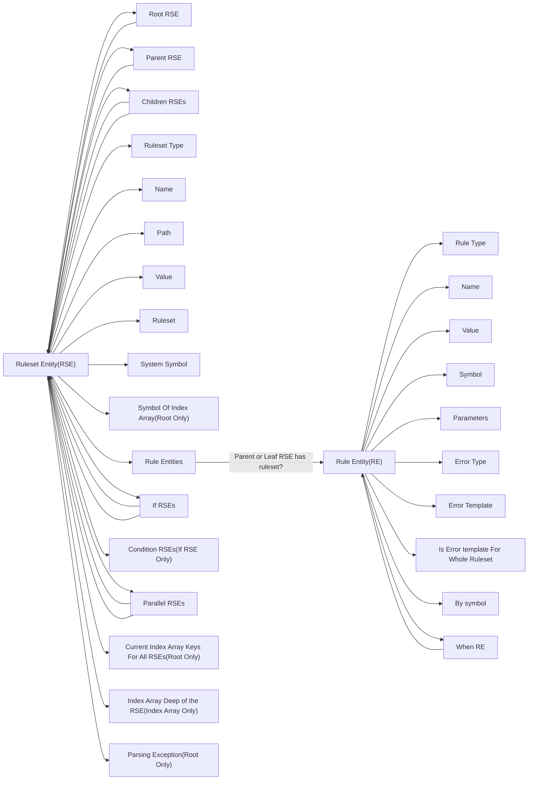

# Entity

> **如何预览结构？**
> - VSCODE 安装拓展 **Markdown Preview Mermaid Support**
> - [Mermaid](https://mermaid.live) 文档

## 概览

为了重用规则集，避免每次验证数据的时候，都必须重新解析规则集，我们先将规则集解析成 Entity，之后将使用 Entity 来验证数据。
Entity 包括：
- **Ruleset Entity(RSE)**: 与规则集数组一样，RSE 也是层层嵌套树状的结构，直到最后的 ruleset。
- **Rule Entity(RE)**: 一个 Ruleset 由一个或多个 rule（正则或者方法）组成。也就是说，一个 RSE 可能包含一个或多个 RE。RE 则是一个个解析过后的方法，包括方法名，参数以及错误模板等等。

## 结构

**Ruleset Type:**
 - `RULESET_TYPE_INDEX_ARRAY`: "rst_index_array"
 - `RULESET_TYPE_ASSOC_ARRAY`: "rst_assoc_array"
 - `RULESET_TYPE_LEAF`: "rst_leaf"
 - `RULESET_TYPE_LEAF_PARALLEL`: "rst_leaf_parallel"
 - `RULESET_TYPE_LEAF_IF`: "rst_leaf_if"
 - `RULESET_TYPE_LEAF_IF_NOT`: "rst_leaf_if_not"
 - `RULESET_TYPE_LEAF_CONDITION`: "rst_leaf_condition"

**Rule Type:**
 - `RULE_TYPE_METHOD`: "method"
 - `RULE_TYPE_PREG`: "preg"
 - `RULE_TYPE_WHEN`: "when"
 - `RULE_TYPE_WHEN_NOT`: "when_not"